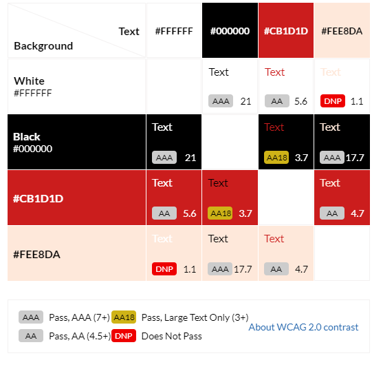
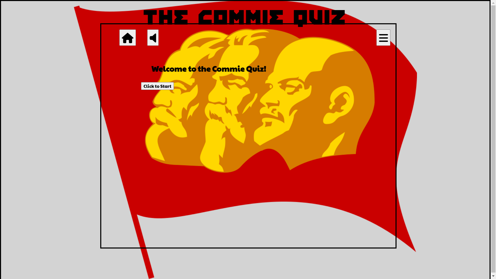
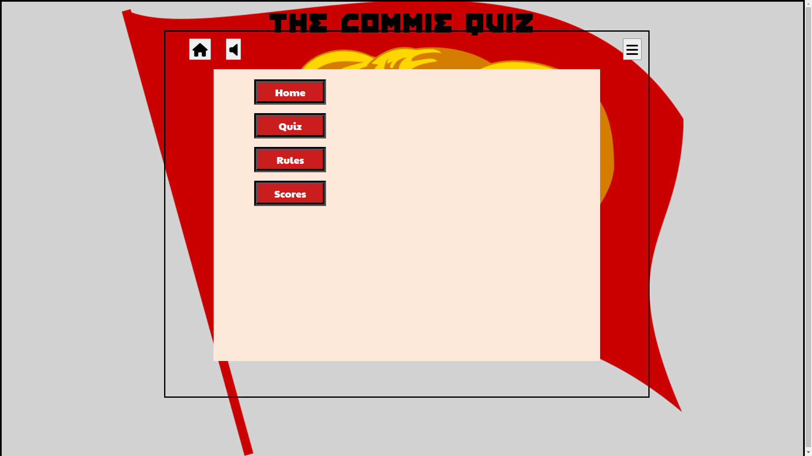

# CommieQuiz

CommieQuiz is an interactive online quiz for users who would like to test their knowledge about Communism in a fun, and challenging way. Users will have the ability to choose the quiz difficulty and the app will calculate a score based on the difficulty chosen according to the rules of the game.

Rules of the game:
- Each game runs for a maximum of 2 minutes.
- Users can select 3 different challenges to alter the maximum response time for each question
    -Comrade - 20s (max 6 questions)
    -Vanguard - 15s (max 8 questions)
    -Intelligentsia- 10s (max 12 questions)
-Each correct answer will earn the user a red star.
-The score is calculated based on the the number of correct answers / max potential for the game level.

#Table of Contents

1. 

    
<a href="#ux">UX</a>

    <ul>
    <li>

    
<a href="#goals">Goals</a>

    - [Visitor Goals](#visitor-goals)
    - [Business Goals](#business-goals)
    - [User Stories](#user-stories)
    
</li>

    <li>

    
<a href="#visual-design">Visual Design</a>

    - [Wireframes](#wireframes)
    - [Fonts](#fonts)
    - [Icons](#icons)
    - [Colors](#colors)
    - [Images](#images)
    - [Styling](#styling)
    
</li>
    </ul>

2. 

    
<a href="#features">Features</a>

    <ul>
    <li>

    
<a href="#page-elements">Page Elements</a>

    - [Header](#header)
    - [Footer](#footer)
    - [About Page](#about-page)
    - [Gallery Page](#gallery-page)
    - [Register Page](#register-page)
    
</li>

    <li>

    
<a href="#feature-ideas">Feature Ideas</a>

    - [Functional](#functional)
    - [Technical](#technical)
    
</li>
    </ul>

3. 

    
<a href="#technologies-used">Technologies Used</a>

4. 

    
<a href="#testing">Testing</a>

    <ul>
    <li>

    
<a href="#methods">Methods</a>

    - [Validation](#validation)
    - [General Testing](#general-testing)
    - [Mobile Testing](#mobile-testing)
    - [Desktop Testing](#desktop-testing)
    
</li>

    <li>

    
<a href="#bugs">Bugs</a>

    - [Known Bugs](#known-bugs)
    
</li>
    </ul>

5. 

    
<a href="#deployment">Deployment</a>

    <li>

    
<a href="#github-deployment">Github Deployment</a>

    - [Github Preparation](#github-preparation)
    - [Github Instructions](#github-instructions)
    
</li>
    </ul>

6. 

    
<a href="#credit-and-contact">Credit and Contact</a>

    - [Content](#content)

# UX
## Goals
### Visitor Goals

The target audience for LatAm Lingo are:
- People who want to learn Mapudungun or Quechua.
- People who want to understand Latin American indiginous cultures.
- People who are interested in different cultures.
- People that may want to reconect with their heritage.
- People interested in working with indiginous colleagues.
- People interested in the exploring Latin America.
- People interested in Latin American history.

User goals are:
- Get an overview of school.
- Evaluate the authenticity of the site.
- Explore the various programs.
- Evaluate the potential benefits from the education.
- Register their interest.
- Enroll in a class.

LatAm Lingo fills these needs by:
- Providing a comprehensive desciption of the methodology, formats and options available.
- Opening with a reasuring image of native teachers and banner followed by a page detailing program qualifications.
- Providing a detailed description of each program.
- Gallery of pictures of places, events and cultures facilitated by education.
- Registration page.
- Program selection options on Registration page.

### Business Goals
LatAm Lingo's business goals extend beyond the professional desire for a profitable business. It includes their societal goal of education and awareness about their native heritage. Founded by a group of indigenous and mestizaje friends who met at university and shared the same dismay about how little their classmates (and society in general) knew about the LatAm indigenous population their primary objective is too keep their cultures alive and gain greater understanding. This has been made easier with the sposorship and support of both government and NGO heritage organisations.

Thus the a summary of business goals would be:
- Build awareness about indigenous cultures and their relevance today.
- Gain mailing list members.
- Inform potential clients about the educational services offered and increase class enrolment.
- Educate the general public about the history of LatAm languages (pre and post-colonisation) and the indigenous populations.
- Gain interest of potential clients and investors, and connect with social media.

### User Stories

1. As a user interested in indigenous culture I expect to find meaningful information.
0. I expect the qualifications first and foremost.
0. As a user interested in language, I expect to see:
    1. Languages taught.
    2. Qualifications earned.
0. As a user interested in different cultures, I expect to see:
    1. Information on the contents of a class.
    2. Identification of each culture offered in the program.
0. As a user, I expect to see:
    1. Information about the time commitment.
    2. Information about time schedules.
0. As a professional user (academic or business), I am interested in the availability of bespoke programs.

## Visual Design
### Wireframes
[Wireframes History](https://drive.google.com/drive/folders/1MC90lZssd6aURDya1wHe3fbtSQ6kODsg?usp=share_link)

### Icons
- Icons are taken from the [Fontawesome](https://fontawesome.com/) Free Icon library.
- Icons are utilised in the footer for social account icons and the "more below" arrow on the gallery page.

### Content

#### Fonts
Both fonts are downloaded from [Google Fonts](https://fonts.google.com)
-Headings: Eczar, Medium 500
-Body: Merriweather, Regular 400

#### Colors
Color base was chosen from a red on in hero image using eyedropper.org. Red is generally associated with Communism and the various shades generated by colormind.io provided a range of options. I then decided on simple set of complementary and contrasting colors. The final selection was chosen using contrast-grid.eightshapes.com for WCAG 2.0 contrast grading as shown below: 
- #FFFFFF (white) -controls button background, button text
- #000000 (black) - text on panels and borders
- #CB1D1D  (commie red) - button backgrounds
- #FEE8DA (light commie red) - panels background

### Images
There are only 2 images; a background image of Marx, Engels and Lenin, and a hammer and sickle used for the favicon.

- Image sources:
-   [Wikimedia](https://commons.wikimedia.org/wiki/File:Marx_Engels_Lenin.svg)
-   [flatiron](https://www.flaticon.com/free-icons/hammer-and-sickle)  Hammer and sickle icons created by Freepik - Flaticon 

- Favicon 
    Generated from [favicon-generator] (https://www.favicon-generator.org/) based on Globe from wikimedia)

### Styling
The overall approach that I took to styling was clarity and consistancy. This included:
- Limited set of fonts and colors
- High contrast on alternating pages
- Distinct header and footer color schemes
- Consistent use of page element styling

This approach carries over to the coding where the styling is organised for use.

# Features
## Page Elements
### Controls bar
The feature provides a consistant area for:
- Navigating to home panel
- Controling the sound
- Navigating to the menu panel
- Countdown timers
- Correct answers

### Landing Page
The Landing Page contains a large inspiring image of three key figures in Communism; Marx, Engels and Lenin. The image is meant to provide the user with immediate reasuring confirmation of the CommieQuiz's function and tone.

The control buttons are always present for consistency and ease of use. Of particular use is the sound button which will play "The International" providing another confirmation of the theme.

The user will be presented with a single button to start the game.

### Game difficulty panel
This feature appears each time the user starts a new game and will provide the ability to vary the time-out minutes for each question.
Note: this feature has not been included yet.

### Menu panel
 
This feature provides the user with navigation buttons to game feature panels.

### Quiz panel

This feature presents a question with 4 potential answers. Upon loading the first question the game timer will display a 2 minute countdown.The user has a set amount of time to choose an option or press the next button.
With each new question, the question timer will display a question timer per the user option.

### Scores panel
Along with the score calculated according to the rules of the game, this feature will provide the user with list of questions answered incorrectly and reference to educational resources.

## Future Ideas
- User registration and score history
- Multi-user registration and history
- Question sets by:
- - Difficulty
- - Topic (e.g. history, social issues, political issues, economic issues)

### Functional - These are UI improvements that could be made with the existing technologies.
- First and foremost a functional game.

### Technical - These are UI improvements that could be gained from incorporating other technologies.
- As I haven't fully applied the current technologies this remains to be seen.

## Technologies Used

- Coding languages
    - html
    - css
    - javascript
- Development environment
    - github
    - gitpod
    - MS Visual Studio
    
## Testing

- As this never made it out of development, I did not conduct rigerous testing. However, in the interest of providing a snap shot of the current state of the project I ran a set of standard test. 
    1. W3C html validation: 4 errors, 1 warning. 
    2. W3C css validation: 0 error, 0 warnings .
    3. JSHint: 0 errors, 46 warnings.
    4. PageSpeedInsight: [Unacceptable Accessibility](/assets/docs/images/pagespeed.png)

## Unfixed Bugs
- Too numerous to list.

## Deployment
### Github Deployment
**Requirements:**
- A free GitHub account.

### Github Instructions
1. Log in to your GitHub account.
2. navigate to [https://github.com/Richard5P/CommieQuiz](https://github.com/Richard5P/CommieQuiz).
3. You can set up your own repository and copy or clone it, or you fork the repository.
4. `git add`, `git commit` and `git push` to a GitHub repository, if necessary.
5. GitHub pages will update from the master branch by default.
6. Go to the **Settings** page of the repository.
7. Scroll down to the **Github Pages** section.
8. Select the Master Branch as the source and **Confirm** the selection.
9. Wait a minute or two and it should be live for viewing. See my own [here](https://richard5p.github.io/CommieQuiz).

## Credits and Contact
### Content
- Countdown inspired by Florin Pop [Simple Countdown Timer with JavaScript](https://www.youtube.com/watch?v=x7WJEmxNlEs&ab_channel=FlorinPop)

Any code utilised from a site is documented and credited within the code.
No credit is required for the other media other than provided by source.

### Contact
Please feel free to contact me at `richard.deutsch@gmail.com`

[def]: ./assets/images/readme_images/am_i_responsive.png